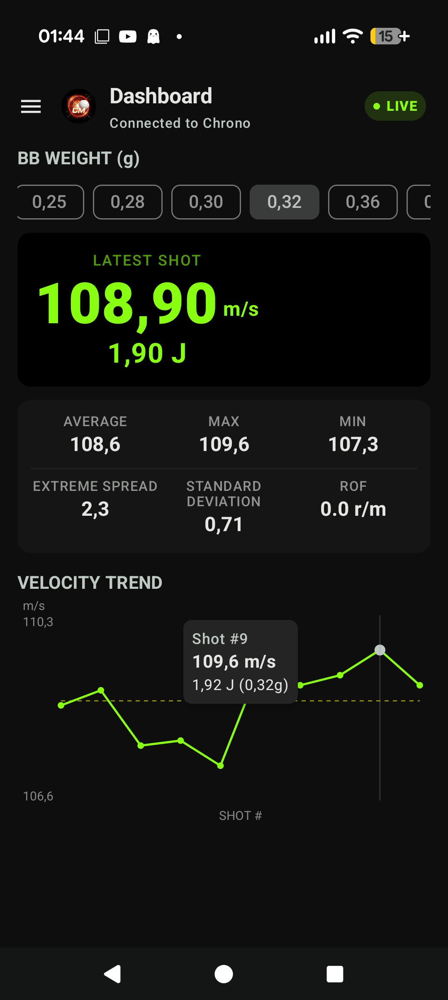
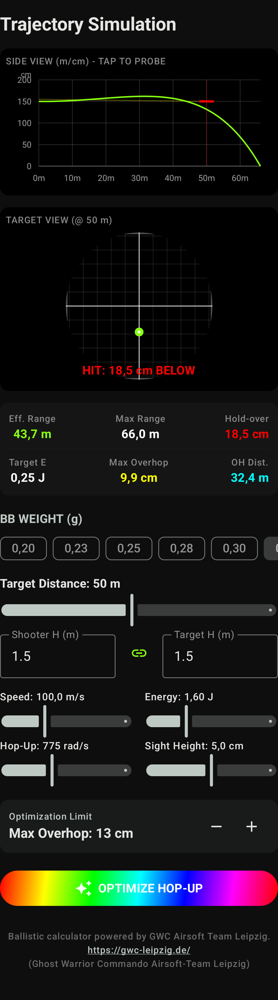
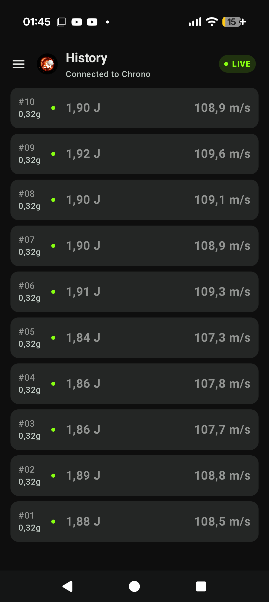
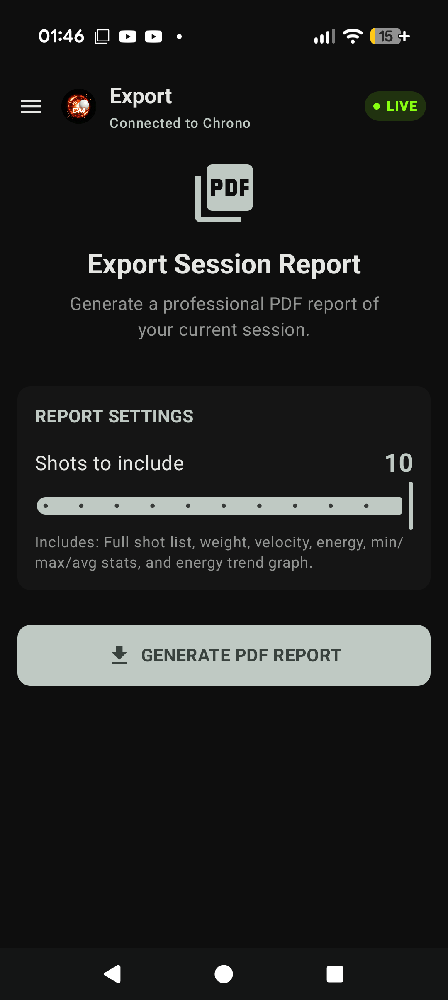
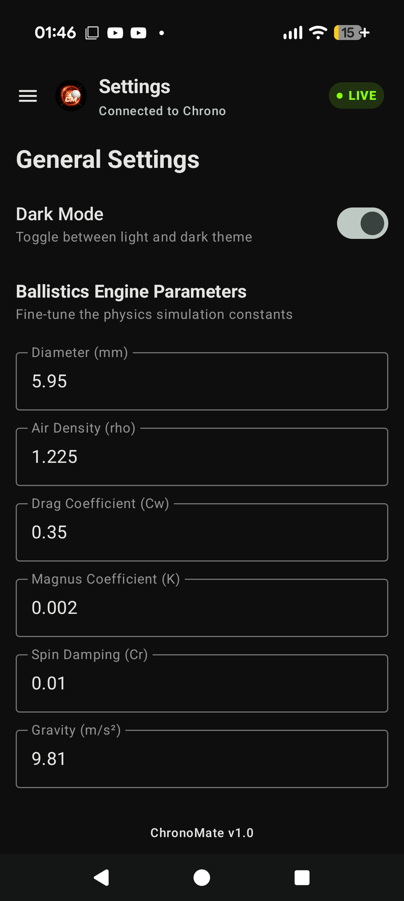
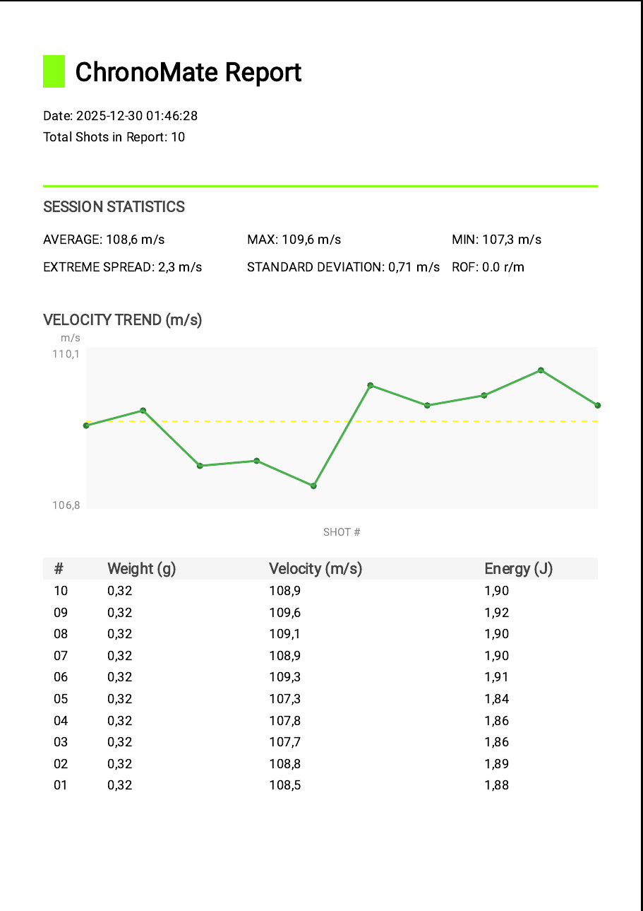

  

# ChronoMate

**ChronoMate** is a high-precision Android companion app for the **HT-X3000 / HT-X3006** airsoft chronograph. It transforms the basic web interface of the device into a comprehensive ballistic laboratory and marshaling toolkit.

## 🚀 Key Features

### 📊 Advanced Dashboard
- **Real-time Synchronization**: Automatically polls the chronograph every second via Wi-Fi.
- **Statistical Analysis**: Instant calculation of Average, Maximum, Minimum, Extreme Spread, Standard Deviation, and Rate of Fire (ROF).
- **Interactive Trend Chart**: A live velocity line graph with axis labels, average trend line, and touch-interactive data points.

### 🛡️ Orga Chrono Mode
- **Marshaling Power**: Designed for field organizers to speed up the chrono station.
- **Joule Reference Grid**: Displays calculated kinetic energy for all standard BB weights (0.20g to 0.45g) simultaneously.
- **Dynamic Limits**: Set your field's Joule limit and see the "Max Allowed BB Weight" for any given setup instantly.

### 🏹 Trajectory Simulation
- **Physics Engine**: Advanced ballistic simulation accounting for Gravity, Air Resistance, and the Magnus Effect.
- **Visual Flight Path**: Interactive side-view graph of the BB's flight with real-time probe data.
- **Target View**: An interactive reticle view showing point-of-impact height at specified distances.
- **Hop-Up Optimization**: Auto-calculate the best hop-up setting for your target distance while staying within "overhop" limits.

### 📋 PDF Export & History
- **Professional Reports**: Generate detailed PDF session reports saved directly to your Downloads folder.
- **Session History**: Track every shot in your session with detailed weight, velocity, and energy data.

### ⚙️ Customization & Persistence
- **Ballistic Parameters**: Fine-tune physics constants like air density, drag coefficients, and BB diameter.
- **Persistent Preferences**: Saves your default BB weight, Joule limits, and ballistic engine tweaks.
- **Dark and Light Mode Support**: High-contrast light theme optimized for field use.

## 📸 Screenshots

| Dashboard | Orga Chrono | Trajectory | History |
| :---: | :---: | :---: | :---: |
|  |  |  |  |

| Export Session | Settings | Generated PDF Report |
| :---: | :---: | :---: |
|  |  |  |

## 🛠 Tech Stack
- **Language**: Kotlin
- **UI Framework**: Jetpack Compose
- **Architecture**: MVVM
- **Networking**: OkHttp3
- **Parsing**: Jsoup for HTML data extraction
- **Graphics**: Compose Canvas for custom ballistic and chart rendering
- **PDF Generation**: Android PDF Document API

## 📥 Installation
1. Ensure your smartphone supports Wi-Fi.
2. Turn on your HT-X3000 Chronograph.
3. Open ChronoMate and connect to the "HT-X3000" Wi-Fi network.
4. The app will automatically start polling data from the device.

---
*Developed for Airsoft enthusiasts and event organizers.*
